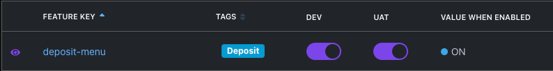

# Welcome to BackOffice UI

| URL  
| ---------------------------------------------- |
| [Staging Admin](http://backoffice-ui.nonprod.pi.internal/)

## Development

Install yarn

Run

```sh
yarn install
```

Configure environment variables for dev environment (see .env.example for reference).
Make sure .env.local should be in your .gitignore

```sh
cp .env.example .env.local
```

Start

```sh
yarn dev

# now you can access http://localhost:3000 for development
```

Prettify

```sh
yarn run format:fix
yarn run lint

# Prettify your code changes before putting in a pull request
```

#### Feature switch using Growthbook

1. To implement feature switch we need to create feature key under Pi Backoffice project in Growthbook
2. Example feature -> deposit-menu
3. Default value is ON
4. Add feature config in ./src/configs/feature.ts

   ```typescript
   const featureConfig: FeatureConfig = {
     DEPOSIT_MENU: {
       name: 'deposit-menu',
       path: '',
     },
     //...
     //...
     //...Add new feature here
   }
   ```

5. Apply config by following instruction from growthbook-react documentation
   <https://www.npmjs.com/package/@growthbook/growthbook-react>

6. Whenever we turn feature switch on/off through Growthbook we'll need to make API call to Feature API to clear cache and fetch new data

   ```curl
   curl --location --request POST 'https://api.nonprod.pi.financial/feature-uat/api/features?project=prj_in781mllu9s1qx'
   ```

7. Refresh the page, then the feature should be turned on/off accordingly.

## Deployment

First, build your app for production:

```sh
yarn build
```

Then run the app in production mode:

```sh
yarn start
```

Now you'll need to pick a host to deploy it to.

## Docker (Test locally)

```sh
cd staging/docker

docker-compose up -d

docker run -it -p 5001:3000 {image-name}
```

## Docs

- [NextAuth] (<https://next-auth.js.org/>)
- [NextJS] (<https://nextjs.org/docs>)
- [Material UI](https://mui.com/getting-started/usage/)
- [notistack](https://iamhosseindhv.com/notistack)
- [React Form Hook](https://react-hook-form.com/get-started)
- [React Query](https://react-query.tanstack.com/overview)
