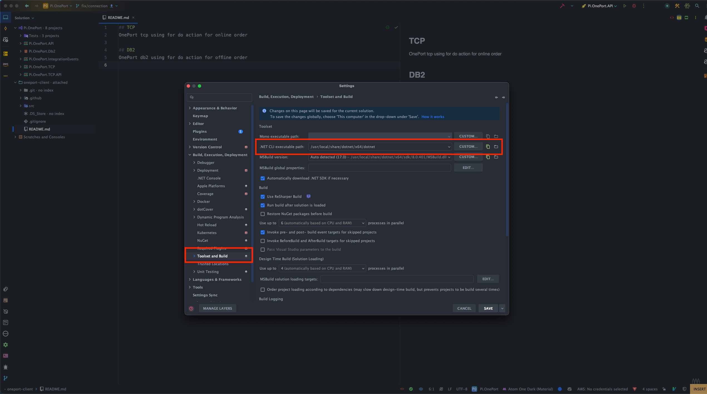

## TCP
OnePort tcp using for do action for online order

## DB2
OnePort db2 using for do action for offline order

### How to run locally
DB2 not support `arm` architecture so you'll need to install dotnet x64 into you local and change the
`.Net CLI executable path` to use x64

#### Rider

