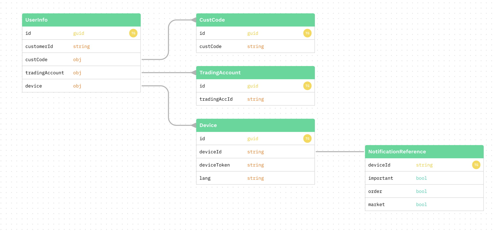

# User Service

### Init SNS
#### Run in Localstack
`awslocal sns create-platform-application --name app-test --platform APNS --attributes {}`

### Database Model

# .NET Service

- [.NET Service](#dotnet-service)
  - [Local Development](#local-development)
    - [Prerequisite](#prerequisite)
    - [Let's start](#lets-start)
    - [Logging](#logging)
    - [Database Migration](#database-migration)
  - [Environment Variables](#environment-variables)

## Local Development

### Prerequisite
- install db migration tool, run `dotnet tool install --global dotnet-ef` (if you never install)
- install and run Seq (log GUI) https://datalust.co/download (Windows using installer, MacOS using docker run)
  
### Let's start
If you run this application for the first time, you need to migrate db first.
- open a terminal and go to `src/Pi.Project.YourService` where docker-compose file is located
- run `docker compose up db`
- run `make update-db` to apply the migration to database
- run `docker compose down`
Then you can run the application by press debug icon to run the application (make sure to select a docker-compose project)

### Logging
Log will go to Console and Seq (only for local dev). You can go to http://localhost:5341 to see the log.
Make sure you have Seq installed (Windows using installer, MacOS using docker run) https://datalust.co/download

### Database Migration
We use EF Core (Code First Migrations) https://learn.microsoft.com/en-us/ef/core/.

XxxDbContext.cs in `infrastructure` project is represent the database for this domain. When you have a database change e.g.,
- add new domain model which need to store in DB
- update domain model
- add new Masstransit Saga Statemachine
- update Saga state
  
then you need to create a migration by
- open a terminal and go to `Pi.Project.Migrations`
- run `make add name=AddExampleColumnToTableAbc` (name is the migration name)
- run `make update-db` to apply the migration to database

to rollback the migration from database
- run `dotnet ef database NameOfLastGoodMigration`, this will rollback database
- then you need to remove the migration from the `migrations` project, run `make remove`, this will remove the last migration.

Learn more about EF Core migration https://learn.microsoft.com/en-us/ef/core/managing-schemas/migrations/?tabs=dotnet-core-cli

Learn more about EF Core Cli https://learn.microsoft.com/en-us/ef/core/cli/dotnet

## Environment Variables
| ENV  | Possible Values | Description  |
|---|---|---|
| ASPNETCORE_ENVIRONMENT | "Development", "Staging", "Production" - default | For API project
| DOTNET_ENVIRONMENT | "Development", "Staging", "Production" - default | For Worker project
| USE_REMOTE_CONFIG | "true", "false" - default | To use remote config from AWS Parameter Store
| REMOTE_CONFIG_LIFETIME_MS | "any number", "1000" - default | Reload remote config after x ms
